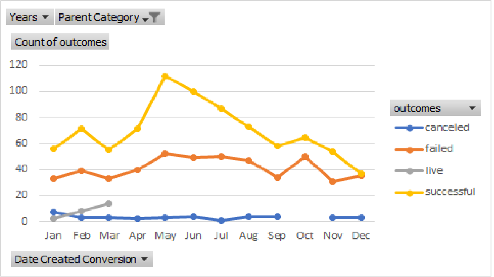

# An Analysis of Kickstarter Campaigns
Performing analysis on Kickstarter data to uncover trends.

### Challenge

Louise's play Fever came close to its fundraising goal in a short amount of time reaching 86% of the goal in under a month. This analysis was performed to see how many other Kickstarter play campaigns were able to do this as well and to specifically look at whether the length of a campaign and the months the projects were launched contributes to its ultimate success or failure. The analyses contain three new tabs:
    Outcomes Based on Goals
    Outcomes Based on Launch Date 
    Outcome Based on Duration (extra)
    
https://github.com/jebouchard/kickstarter-analysis/blob/master/Outcomes%20Based%20on%20Goals.png
     
From the Outcome Based on Goals graphic (above) it can be seen that the highest number of successful projects were in the $1,000 to $4,999 range with a total of 388. The impact of success based on goals can be seen by comparing the number of failed projects in the $1,000 to $4,999 to the number of successful projects in that range. The slope of the line graph leading up to and away from the failed projects point of 146 is shallower than the slopes leading up to and away from the successful projects in the same range. This shallower slope indicates a higher rate of successful projects vs. failed projects in this range. This higher rate of successful projects can also be seen by the relative distance between the successful and failed project in this range.
    
 
    
From the Outcome Based on Launch Date graph (above) it can be seen that the most successful projects were launched in the summer (May through August) with May being the peak. The separation between the successful and failed projects in May is the largest of all months, which indicates a larger percentage of successful projects vs. failed projects in the month of May and this larger percentage indicates this is not just due to more projects being launched in the summer or May in particular. 

(Outcomes Based on Duration.png)

Additional anaylses (beyond the analyses requested) were conducted to look at the impact of duration on success of the campaigns. From the Outcome Based on Duration graph (above) it can be seen that the most successful campaigns had a duration of 3 to 6 weeks, with the peak at 4 to 5 weeks. The separation between the successful and failed campaigns in the 3 to 6 week period is the largest of all months, which indicates a larger percentage of successful projects vs. failed projects, but the increase is modest.

Conclusions of the analyses are:
Goals impacts success of campaign with the largest percentage of successful campaigns in the $1,000 to $4,999 range.
Launch date impacts the success of the campaign with the largest percentage of successful campaigns launching in the summer (May through August)
While the duration of the campaigns had some impact on success, it was a modest impact with the largest percentage of successful campaigns in the 3 to 6 week duration window.

 
Limitations of the analyses include that the variables of goal and launch date were chosen from the large number of variables in the dataset with out doing a comprehensive review of the date to find and test other variables that may correlate to success.  Additionally, the ranges chosen for the Outcome Based on Goals was arbitrary, an independent review of the ranges may have lead to other ranges for analyses. Other limitations are the data only go through 2017, so more recent data if available may yield different results.  

Although it seems unusual that there no canceled campaigns, a review of all the categories indicated that cancellations only happened in 11 of the 41 subcategories, so it not unusual since  73% of subcategories had no cancelations. This probable indicates that these campaigns are run to failure rather than cancel them short of failure (or success).

Based on the above identified limitations, the following additional analyses are suggested:
   - Since only minimal impact of duration on success, the could look at the rate of funds raised in % of goal/month to see if that had any impact.
   - Could further refine the goal categories within the 1,000 to 4,999 range for Outcome Based on Goals to see if there was sensitivity within the range
